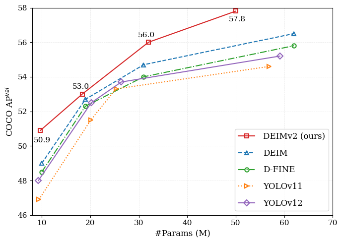
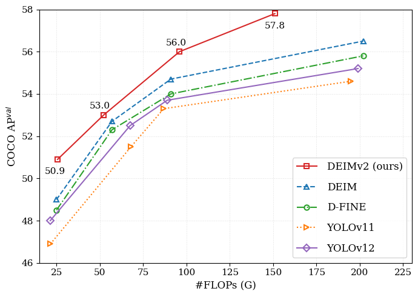

<h2 align="center">
  实时目标检测遇见 DINOv3
</h2>
<h3 align="center">

🎉 我们激动地推出 <a href="https://intellindust-ai-lab.github.io/projects/EdgeCrafter/">EdgeCrafter</a>，在目标检测、姿态估计以及实例分割任务上均达到了最先进的性能。🎉

</h3>

<p align="center">
    <a href="https://github.com/Intellindust-AI-Lab/DEIMv2/blob/master/LICENSE">
        
    </a>
    <a href="https://arxiv.org/abs/2509.20787">
        
    </a>
   <a href="https://intellindust-ai-lab.github.io/projects/DEIMv2/">
        
    </a>
    <a href="https://github.com/Intellindust-AI-Lab/DEIMv2/pulls">
        
    </a>
    <a href="https://github.com/Intellindust-AI-Lab/DEIMv2/issues">
        
    </a>
    <a href="https://github.com/Intellindust-AI-Lab/DEIMv2">
        
    </a>
    <a href="mailto:shenxi@intellindust.com">
        
    </a>
</p>

<p align="center">
    DEIMv2 是 DEIM 框架的进化版本，同时利用了 DINOv3 的丰富特征。我们的方法设计了多种模型尺寸，从超轻量版本到 S、M、L 和 X 版本，以适应广泛的场景。在这些变体中，DEIMv2 实现了最先进的性能，其中 S 尺寸的模型在具有挑战性的 COCO 基准测试上显著超过了 50 AP。
</p>

---

<div align="center">
  黄世华<sup>1*</sup>,&nbsp;&nbsp;
  侯永杰<sup>1,2*</sup>,&nbsp;&nbsp;
  刘龙飞<sup>1*</sup>,&nbsp;&nbsp;
  <a href="https://xuanlong-yu.github.io/">于轩龙</a><sup>1</sup>,&nbsp;&nbsp;
  <a href="https://xishen0220.github.io">沈熙</a><sup>1†</sup>&nbsp;&nbsp;
</div>

<p align="center">
<i>
1. <a href="https://intellindust-ai-lab.github.io"> Intellindust AI Lab</a> &nbsp;&nbsp; 2. 厦门大学 &nbsp; <br> 
* 同等贡献 &nbsp;&nbsp; † 通讯作者
</i>
</p>

<p align="center">
<strong>如果您喜欢我们的工作，请给我们一个 ⭐！</strong>
</p>

<p align="center">
  
  
</p>

</details>

## 🚀 更新

- [x] **\[2026.3.26\]** 🔥🔥🔥适配了RKNN瑞芯微框架
- [x] **\[2026.3.20\]** 大家好！**我们激动地推出 [EdgeCrafter](https://intellindust-ai-lab.github.io/projects/EdgeCrafter/)，这是我们最新的工作，实现了新的最先进性能——比以往更快、更准确、更易于使用。** 它还支持多种视觉任务，包括目标检测、实例分割和人体姿态估计！
- [x] **\[2026.1.7\]** DEIMv2 中引入的 STA 已集成到最先进的蒸馏库 [LightlyTrain](https://github.com/lightly-ai/lightly-train/blob/1fbe09744891727b4b494583ee62f35e7b7b1668/src/lightly_train/_task_models/dinov3_ltdetr_object_detection/dinov3_vit_wrapper.py#L15) 中，展示了其在真实训练流程中的实用价值和影响力。
- [x] **\[2026.1.7\]** FP16 推理修复：**请使用 TensorRT ≥ 10.6 以确保稳定执行和正确的检测结果。** 有关详细的部署说明，请参考 [部署指南](https://github.com/Intellindust-AI-Lab/DEIMv2?tab=readme-ov-file#4-tools)。
- [x] **\[2025.11.3\]** [我们已将模型上传至 Hugging Face](https://huggingface.co/Intellindust)！感谢 NielsRogge！
- [x] **\[2025.10.28\]** 优化了 ViT-Tiny 中的注意力模块，使 S 和 M 模型的内存使用量减少了一半。
- [x] **\[2025.10.2\]** [DEIMv2 已集成到 X-AnyLabeling 中！](https://github.com/Intellindust-AI-Lab/DEIMv2/issues/25#issue-3473960491) 非常感谢 X-AnyLabeling 的维护者们促成了这一集成。
- [x] **\[2025.9.26\]** 发布 DEIMv2 系列模型。

## 🧭 目录

* [1. 🤖 模型库](#1-模型库)
* [2. ⚡ 快速开始](#2-快速开始)
* [3. 🛠️ 使用指南](#3-使用指南)
* [4. 🧰 工具](#4-工具)

## 0、RKNN模块

[导出onnx和rknn](./tools/deployment/README.MD#基础模型)

## 1. 模型库

| 模型 | 数据集 | AP | 参数量 | GFLOPs | 延迟 (毫秒) | 配置 | Hugging Face | 检查点 | 日志 |
| :---: | :---: | :---: | :---: | :---: |:------------:| :---: | :---: | :---: | :---: |
| **Atto** | COCO | **23.8** | 0.5M | 0.8 | 1.10 | [yml](./configs/deimv2/deimv2_hgnetv2_atto_coco.yml) | [huggingface](https://huggingface.co/Intellindust/DEIMv2_HGNetv2_ATTO_COCO) | [Google](https://drive.google.com/file/d/18sRJXX3FBUigmGJ1y5Oo_DPC5C3JCgYc/view?usp=sharing) / [Quark](https://pan.quark.cn/s/04c997582fca) | [Google](https://drive.google.com/file/d/1M7FLN8EeVHG02kegPN-Wxf_9BlkghZfj/view?usp=sharing) / [Quark](https://pan.quark.cn/s/7bf3548d3e10) |
| **Femto** | COCO | **31.0** | 1.0M | 1.7 | 1.45 | [yml](./configs/deimv2/deimv2_hgnetv2_femto_coco.yml) | [huggingface](https://huggingface.co/Intellindust/DEIMv2_HGNetv2_FEMTO_COCO) | [Google](https://drive.google.com/file/d/16hh6l9Oln9TJng4V0_HNf_Z7uYb7feds/view?usp=sharing) / [Quark](https://pan.quark.cn/s/169f3cefec1b) | [Google](https://drive.google.com/file/d/1_KWVfOr3bB5TMHTNOmDIAO-tZJmKB9-b/view?usp=sharing) / [Quark](https://pan.quark.cn/s/9dd5c4940199) |
| **Pico** | COCO | **38.5** | 1.5M | 5.2 | 2.13 | [yml](./configs/deimv2/deimv2_hgnetv2_pico_coco.yml) | [huggingface](https://huggingface.co/Intellindust/DEIMv2_HGNetv2_PICO_COCO) | [Google](https://drive.google.com/file/d/1PXpUxYSnQO-zJHtzrCPqQZ3KKatZwzFT/view?usp=sharing) / [Quark](https://pan.quark.cn/s/0db5b1dff721) | [Google](https://drive.google.com/file/d/1GwyWotYSKmFQdVN9k2MM6atogpbh0lo1/view?usp=sharing) / [Quark](https://pan.quark.cn/s/5ab2a74bb867) |
| **N** | COCO | **43.0** | 3.6M | 6.8 | 2.32 | [yml](./configs/deimv2/deimv2_hgnetv2_n_coco.yml) | [huggingface](https://huggingface.co/Intellindust/DEIMv2_HGNetv2_N_COCO) | [Google](https://drive.google.com/file/d/1G_Q80EVO4T7LZVPfHwZ3sT65FX5egp9K/view?usp=sharing) / [Quark](https://pan.quark.cn/s/1f626f191d11) | [Google](https://drive.google.com/file/d/1QhYfRrUy8HrihD3OwOMJLC-ATr97GInV/view?usp=sharing) / [Quark](https://pan.quark.cn/s/54e5c89675b3) |
| **S** | COCO | **50.9** | 9.7M | 25.6 | 5.78 | [yml](./configs/deimv2/deimv2_dinov3_s_coco.yml) | [huggingface](https://huggingface.co/Intellindust/DEIMv2_DINOv3_S_COCO) | [Google](https://drive.google.com/file/d/1MDOh8UXD39DNSew6rDzGFp1tAVpSGJdL/view?usp=sharing) / [Quark](https://pan.quark.cn/s/f4d05c349a24) | [Google](https://drive.google.com/file/d/1ydA4lWiTYusV1s3WHq5jSxIq39oxy-Nf/view?usp=sharing) / [Quark](https://pan.quark.cn/s/277660d785d2) |
| **M** | COCO | **53.0** | 18.1M | 52.2 | 8.80 | [yml](./configs/deimv2/deimv2_dinov3_m_coco.yml) | [huggingface](https://huggingface.co/Intellindust/DEIMv2_DINOv3_M_COCO) | [Google](https://drive.google.com/file/d/1nPKDHrotusQ748O1cQXJfi5wdShq6bKp/view?usp=sharing) / [Quark](https://pan.quark.cn/s/68a719248756) | [Google](https://drive.google.com/file/d/1i05Q1-O9UH-2Vb52FpFJ4mBG523GUqJU/view?usp=sharing) / [Quark](https://pan.quark.cn/s/32af04f3e4b4) |
| **L** | COCO | **56.0** | 32.2M | 96.7 | 10.47 | [yml](./configs/deimv2/deimv2_dinov3_l_coco.yml) | [huggingface](https://huggingface.co/Intellindust/DEIMv2_DINOv3_L_COCO) | [Google](https://drive.google.com/file/d/1dRJfVHr9HtpdvaHlnQP460yPVHynMray/view?usp=sharing) / [Quark](https://pan.quark.cn/s/966b7ef89bdf) | [Google](https://drive.google.com/file/d/13mrQxyrf1kJ45Yd692UQwdb7lpGoqsiS/view?usp=sharing) / [Quark](https://pan.quark.cn/s/182bd52562a7) |
| **X** | COCO | **57.8** | 50.3M | 151.6 | 13.75 | [yml](./configs/deimv2/deimv2_dinov3_x_coco.yml) | [huggingface](https://huggingface.co/Intellindust/DEIMv2_DINOv3_X_COCO) | [Google](https://drive.google.com/file/d/1pTiQaBGt8hwtO0mbYlJ8nE-HGztGafS7/view?usp=sharing) / [Quark](https://pan.quark.cn/s/038aa966b283) | [Google](https://drive.google.com/file/d/13QV0SwJw1wHl0xHWflZj1KstBUAovSsV/view?usp=drive_link) / [Quark](https://pan.quark.cn/s/333aba42b4bb) |

## 2. 快速开始

### 2.0 使用 Hugging Face 上的模型

我们目前已在 Hugging Face 上发布了模型！这里有一个简单的例子。您可以在 [hf_models.ipynb](./hf_models.ipynb) 中查看详细的配置和更多示例。

<details>
<summary> 简单示例 </summary>

在 DEIMv2 的目录中创建一个 .py 文件，确保所有组件都能成功加载。

```shell
import torch.nn as nn
from huggingface_hub import PyTorchModelHubMixin

from engine.backbone import HGNetv2, DINOv3STAs
from engine.deim import HybridEncoder, LiteEncoder
from engine.deim import DFINETransformer, DEIMTransformer
from engine.deim.postprocessor import PostProcessor


class DEIMv2(nn.Module, PyTorchModelHubMixin):
    def __init__(self, config):
        super().__init__()
        self.backbone = DINOv3STAs(**config["DINOv3STAs"])
        self.encoder = HybridEncoder(**config["HybridEncoder"])
        self.decoder = DEIMTransformer(**config["DEIMTransformer"])
        self.postprocessor = PostProcessor(**config["PostProcessor"])

    def forward(self, x, orig_target_sizes):
        x = self.backbone(x)
        x = self.encoder(x)
        x = self.decoder(x)
        x = self.postprocessor(x, orig_target_sizes)

        return x

deimv2_s_config = {
  "DINOv3STAs": {
    ...
  },
  ...
}

deimv2_s_hf = DEIMv2.from_pretrained("Intellindust/DEIMv2_DINOv3_S_COCO")
```

</details>

### 2.1 环境配置

```shell
# 您可以使用 PyTorch 2.5.1 或 2.4.1。我们未尝试过其他版本，但建议 PyTorch 版本为 2.0 或更高。

conda create -n deimv2 python=3.11 -y
conda activate deimv2
pip install -r requirements.txt
```

### 2.2 数据准备

<details open>
<summary> 2.2.1 COCO2017 数据集 </summary>

按照以下步骤准备 COCO 数据集：

1. 从 [OpenDataLab](https://opendatalab.com/OpenDataLab/COCO_2017) 或 [COCO](https://cocodataset.org/#download) 下载 COCO2017。
2. 修改 [coco_detection.yml](./configs/dataset/coco_detection.yml) 中的路径。
   
   ```yaml
   train_dataloader:
       img_folder: /data/COCO2017/train2017/
       ann_file: /data/COCO2017/annotations/instances_train2017.json
   val_dataloader:
       img_folder: /data/COCO2017/val2017/
       ann_file: /data/COCO2017/annotations/instances_val2017.json
   ```

</details>

<details>
<summary>2.2.2 (可选) 自定义数据集</summary>

要在您的自定义数据集上进行训练，您需要将其组织成 COCO 格式。按照以下步骤准备您的数据集：

1. **将 `remap_mscoco_category` 设置为 `False`：**
   
   这可以防止自动将类别 ID 重新映射以匹配 MSCOCO 类别。
   
   ```yaml
   remap_mscoco_category: False
   ```
2. **组织图像：**
   
   如下所示构建您的数据集目录结构：
   
   ```shell
   dataset/
   ├── images/
   │   ├── train/
   │   │   ├── image1.jpg
   │   │   ├── image2.jpg
   │   │   └── ...
   │   ├── val/
   │   │   ├── image1.jpg
   │   │   ├── image2.jpg
   │   │   └── ...
   └── annotations/
       ├── instances_train.json
       ├── instances_val.json
       └── ...
   ```
   
   - **`images/train/`**：包含所有训练图像。
   - **`images/val/`**：包含所有验证图像。
   - **`annotations/`**：包含 COCO 格式的标注文件。
3. **将标注转换为 COCO 格式：**
   
   如果您的标注还不是 COCO 格式，您需要进行转换。您可以使用以下 Python 脚本作为参考，或利用现有工具：
   
   ```python
   import json
   
   def convert_to_coco(input_annotations, output_annotations):
       # 在此处实现转换逻辑
       pass
   
   if __name__ == "__main__":
       convert_to_coco('path/to/your_annotations.json', 'dataset/annotations/instances_train.json')
   ```
4. **更新配置文件：**
   
   修改您的 [custom_detection.yml](./configs/dataset/custom_detection.yml)。
   
   ```yaml
   task: detection
   
   evaluator:
     type: CocoEvaluator
     iou_types: ['bbox', ]
   
   num_classes: 777 # 您的数据集类别数
   remap_mscoco_category: False
   
   train_dataloader:
     type: DataLoader
     dataset:
       type: CocoDetection
       img_folder: /data/yourdataset/train
       ann_file: /data/yourdataset/train/train.json
       return_masks: False
       transforms:
         type: Compose
         ops: ~
     shuffle: True
     num_workers: 4
     drop_last: True
     collate_fn:
       type: BatchImageCollateFunction
   
   val_dataloader:
     type: DataLoader
     dataset:
       type: CocoDetection
       img_folder: /data/yourdataset/val
       ann_file: /data/yourdataset/val/ann.json
       return_masks: False
       transforms:
         type: Compose
         ops: ~
     shuffle: False
     num_workers: 4
     drop_last: False
     collate_fn:
       type: BatchImageCollateFunction
   ```

</details>

### 2.3 骨干网络准备

- **基于 HGNetv2 的版本**：骨干网络将在训练期间自动下载，因此您无需担心。
- **DEIMv2-L 和 X**：我们使用 DINOv3-S 和 S+ 作为骨干网络，您可以按照 [DINOv3](https://github.com/facebookresearch/dinov3) 中的指南下载它们。
- **DEIMv2-S 和 M**：我们使用从 DINOv3-S 蒸馏得到的 ViT-Tiny 和 ViT-Tiny+，您可以从 [ViT-Tiny](https://drive.google.com/file/d/1YMTq_woOLjAcZnHSYNTsNg7f0ahj5LPs/view?usp=sharing) 和 [ViT-Tiny+](https://drive.google.com/file/d/1COHfjzq5KfnEaXTluVGEOMdhpuVcG6Jt/view?usp=sharing) 下载它们。

将 dinov3 和 vits 放入 ./ckpts 文件夹，结构如下：

```shell
ckpts/
├── dinov3_vits16.pth
├── vitt_distill.pt
├── vittplus_distill.pt
└── ...
```

## 3. 使用指南

<details open>
<summary> 3.1 COCO2017 </summary>

1. 训练
   
   ```shell
   # 对于基于 ViT 的变体
   CUDA_VISIBLE_DEVICES=0,1,2,3 torchrun --master_port=7777 --nproc_per_node=4 train.py -c configs/deimv2/deimv2_dinov3_${model}_coco.yml --use-amp --seed=0
   
   # 对于基于 HGNetv2 的变体
   CUDA_VISIBLE_DEVICES=0,1,2,3 torchrun --master_port=7777 --nproc_per_node=4 train.py -c configs/deimv2/deimv2_hgnetv2_${model}_coco.yml --use-amp --seed=0
   ```
2. 测试
   
   ```shell
   # 对于基于 ViT 的变体
   CUDA_VISIBLE_DEVICES=0,1,2,3 torchrun --master_port=7777 --nproc_per_node=4 train.py -c configs/deimv2/deimv2_dinov3_${model}_coco.yml --test-only -r model.pth
   
   # 对于基于 HGNetv2 的变体
   CUDA_VISIBLE_DEVICES=0,1,2,3 torchrun --master_port=7777 --nproc_per_node=4 train.py -c configs/deimv2/deimv2_hgnetv2_${model}_coco.yml --test-only -r model.pth
   ```
3. 微调
   
   ```shell
   # 对于基于 ViT 的变体
   CUDA_VISIBLE_DEVICES=0,1,2,3 torchrun --master_port=7777 --nproc_per_node=4 train.py -c configs/deimv2/deimv2_dinov3_${model}_coco.yml --use-amp --seed=0 -t model.pth
   
   # 对于基于 HGNetv2 的变体
   CUDA_VISIBLE_DEVICES=0,1,2,3 torchrun --master_port=7777 --nproc_per_node=4 train.py -c configs/deimv2/deimv2_hgnetv2_${model}_coco.yml --use-amp --seed=0 -t model.pth
   ```

</details>

<details>
<summary> 3.2 (可选) 自定义批次大小 </summary>

例如，如果您想在 COCO2017 上训练 **DEIMv2-S** 并将总批次大小加倍至 64，则应执行以下步骤：

1. **修改您的 [deimv2_dinov3_s_coco.yml](./configs/deimv2/deimv2_dinov3_s_coco.yml)** 以增加 `total_batch_size`：
   
   ```yaml
   train_dataloader:
     total_batch_size: 64 
     dataset: 
       transforms:
         ops:
           ...
   
     collate_fn:
       ...
   ```
2. **修改您的 [deimv2_dinov3_s_coco.yml](./configs/deimv2/deimv2_dinov3_s_coco.yml)**。关键参数应调整如下：
   
   ```yaml
   optimizer:
     type: AdamW
   
     params: 
       -
         # 排除 self.dinov3 中的 norm/bn/bias
         params: '^(?=.*.dinov3)(?!.*(?:norm|bn|bias)).*$'  
         lr: 0.00005  # 加倍，遵循线性缩放定律
       -
         # 包括 self.dinov3 中的所有 norm/bn/bias
         params: '^(?=.*.dinov3)(?=.*(?:norm|bn|bias)).*$'    
         lr: 0.00005   # 加倍，遵循线性缩放定律
         weight_decay: 0.
       - 
         # 包括除 self.dinov3 之外的所有 norm/bn/bias
         params: '^(?=.*(?:sta|encoder|decoder))(?=.*(?:norm|bn|bias)).*$'
         weight_decay: 0.
   
     lr: 0.0005   # 如果需要，遵循线性缩放定律
     betas: [0.9, 0.999]
     weight_decay: 0.0001
   
   ema:  # 添加 EMA 设置
     decay: 0.9998  # 根据 1 - (1 - decay) * 2 调整
     warmups: 500  # 减半
   
   lr_warmup_scheduler:
     warmup_duration: 250  # 减半
   ```

</details>

<details>
<summary> 3.3 (可选) 自定义输入尺寸 </summary>

如果您想以 320x320 的输入尺寸在 COCO2017 上训练 **DEIMv2-S**，请按照以下步骤操作：

1. **修改您的 [deimv2_dinov3_s_coco.yml](./configs/deimv2/deimv2_dinov3_s_coco.yml)**：
   
   ```yaml
   eval_spatial_size: [320, 320]
   
   train_dataloader:
     # 这里我们以 total_batch_size 设置为 64 为例。
     total_batch_size: 64 
     dataset: 
       transforms:
         ops:
           #  对于 Mosaic 增强，建议 output_size = input_size / 2。
           - {type: Mosaic, output_size: 160, rotation_range: 10, translation_range: [0.1, 0.1], scaling_range: [0.5, 1.5],
              probability: 1.0, fill_value: 0, use_cache: True, max_cached_images: 50, random_pop: True}
           ...
           - {type: Resize, size: [320, 320], }
           ...
       collate_fn:
         base_size: 320
         ...
   
   val_dataloader:
     dataset:
       transforms:
         ops:
           - {type: Resize, size: [320, 320], }
           ...
   ```

</details>

<details>
<summary> 3.4 (可选) 自定义训练轮次 </summary>

如果您想对 **DEIMv2-S** 进行 **20** 个轮次的微调，请按照以下步骤操作（仅供参考；请根据您的需要自由调整）：

```yml
epoches: 32 #  总轮次：训练 20 轮 + EMA 用于 4n = 12 轮。n 指的是匹配配置中的模型大小。

flat_epoch: 14    # 4 + 20 // 2
no_aug_epoch: 12  # 4n

train_dataloader:
  dataset: 
    transforms:
      ops:
        ...
      policy:
        epoch: [4, 14, 20]   # [起始轮次, 平坦轮次, 总轮次 - 无增强轮次]

  collate_fn:
    ...
    mixup_epochs: [4, 14]  # [起始轮次, 平坦轮次]
    stop_epoch: 20  # 总轮次 - 无增强轮次
    copyblend_epochs: [4, 20]  # [起始轮次, 总轮次 - 无增强轮次]
  
DEIMCriterion:
  matcher:
    ...
    matcher_change_epoch: 18  # ~90% of (总轮次 - 无增强轮次)
```

</details>

## 4. 工具

<details>
<summary> 4.1 部署 </summary>

1. 环境配置
   
   ```shell
   pip install onnx onnxsim
   ```
2. 导出 onnx
   
   ```shell
   python tools/deployment/export_onnx.py --check -c configs/deimv2/deimv2_dinov3_${model}_coco.yml -r model.pth
   ```
3. 导出 [tensorrt](https://docs.nvidia.com/deeplearning/tensorrt/install-guide/index.html)
   
   ```shell
   trtexec --onnx="model.onnx" --saveEngine="model.engine" --fp16
   ```

⚠️ **TensorRT 版本说明**

- ✅ 推荐：**使用 TensorRT ≥ 10.6 进行 FP16 推理**，以确保稳定执行和正确的检测结果。
- ❗ 已知问题：使用 TensorRT 10.4 时，FP16 推理可能产生不正确的输出。
- 🔧 针对旧版本（例如 10.4）的解决方法：
  
  - 以 FP32 模式运行推理，或
  - 仔细验证导出的引擎和端到端流程，以确认数值正确性和检测性能。

</details>

<details>
<summary> 4.2 推理 (可视化) </summary>

1. 环境配置
   
   ```shell
   pip install -r tools/inference/requirements.txt
   ```
2. 推理 (onnxruntime / tensorrt / torch)
   
   现已支持对图像和视频进行推理。
   
   ```shell
   python tools/inference/onnx_inf.py --onnx model.onnx --input image.jpg  # video.mp4
   python tools/inference/trt_inf.py --trt model.engine --input image.jpg
   python tools/inference/torch_inf.py -c configs/deimv2/deimv2_dinov3_${model}_coco.yml -r model.pth --input image.jpg --device cuda:0
   ```

</details>

<details>
<summary> 4.3 基准测试 </summary>

1. 环境配置
   
   ```shell
   pip install -r tools/benchmark/requirements.txt
   ```
2. 模型 FLOPs、MACs 和参数量
   
   ```shell
   python tools/benchmark/get_info.py -c configs/deimv2/deimv2_dinov3_${model}_coco.yml
   ```
3. TensorRT 延迟测试
   
   ```shell
   python tools/benchmark/trt_benchmark.py --COCO_dir path/to/COCO2017 --engine_dir model.engine
   ```

</details>

<details>
<summary> 4.4 Fiftyone 可视化  </summary>

1. 环境配置
   ```shell
   pip install fiftyone
   ```
2. Voxel51 Fiftyone 可视化 ([fiftyone](https://github.com/voxel51/fiftyone))
   ```shell
   python tools/visualization/fiftyone_vis.py -c configs/deimv2/deimv2_dinov3_${model}_coco.yml -r model.pth
   ```

</details>

<details>
<summary> 4.5 其他 </summary>

1. 自动恢复训练
   
   ```shell
   bash reference/safe_training.sh
   ```
2. 转换模型权重
   
   ```shell
   python reference/convert_weight.py model.pth
   ```

```
